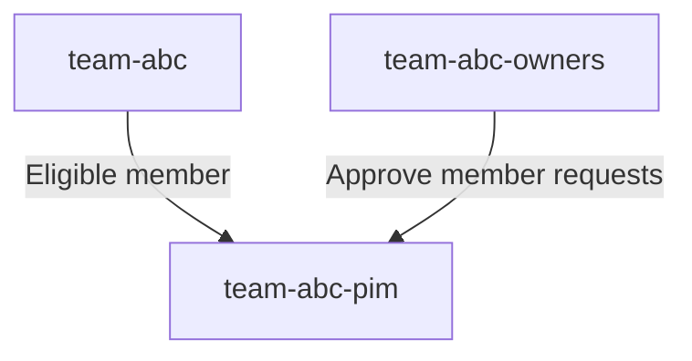

# Entra PIM Group Demo

> :warning: Terraform support was merged into [main 08.Mai.2024](https://github.com/hashicorp/terraform-provider-azuread/pull/1327#event-12736849942). Please see #32 issue for up to date migration information.

This repo´s intent to demonstrate the use of Entra PIM for Group using Infrastructure as Code (IaC).

The repo will setup up the following group and PIM settings:



Acompaning blog post can be found at: [my blog](https://fredrkl.com/blog/privileged-identity-management-for-groups-in-azure/).

## Setup

The Service Principal (SP) used by Terraform need the following permissions:

- `Group.ReadWrite.All`
- `Directory.ReadWrite.All`
- `RoleManagementPolicy.Read.AzureADGroup`
- `RoleManagementPolicy.ReadWrite.AzureADGroup`
- `PrivilegedEligibilitySchedule.ReadWrite.AzureADGroup`
- `PrivilegedEligibilitySchedule.Remove.AzureADGroup`

## Notes

We will use the [Microsoft Graph API documentation](https://learn.microsoft.com/en-us/graph/api/resources/privilegedidentitymanagement-for-groups-api-overview?view=graph-rest-1.0) to make API requests and programmatically setup PIM for Groups. Espesially, we will be using the [unifiedRoleManagementPolicy](https://learn.microsoft.com/en-us/graph/api/resources/unifiedrolemanagementpolicy?view=graph-rest-1.0) API.

There are ongoing Azure Entra PIM Terraform support issues:

- [Generic PIM Support](https://github.com/hashicorp/terraform-provider-azuread/issues/68)
- [PIM Group Management PR](https://github.com/hashicorp/terraform-provider-azuread/pull/1327)

The issues have been open for many years. One reason is the complexity of the PIM API and its versions: https://learn.microsoft.com/en-us/entra/id-governance/privileged-identity-management/pim-apis.

Following the example at https://learn.microsoft.com/en-us/graph/api/unifiedrolemanagementpolicy-update?view=graph-rest-1.0&tabs=powershell#example-2-update-the-details-of-a-policy-defined-in-pim-for-groups.

## Powershell

- [Install powershell](https://learn.microsoft.com/en-us/powershell/scripting/install/installing-powershell?view=powershell-7.4).
- Go into powershell mode.

```
pwsh
```

- Install Az.Resources module
- Install-Module -Name Microsoft.Graph -Scope CurrentUser -AllowClobber

```
Install-Module -Name Az -AllowClobber -Scope CurrentUser
```

- Login using

```
Connect-AzAccount
```

- Connect to Microsoft Graph

```
Connect-MgGraph -Scopes "RoleManagementPolicy.Read.AzureADGroup", "RoleManagementPolicy.ReadWrite.AzureADGroup", "PrivilegedEligibilitySchedule.ReadWrite.AzureADGroup", "PrivilegedAccess.ReadWrite.AzureADGroup"
```

- Run the script

```
update-pim-rules.ps1
```
## Pre-commit hooks for terraform files (optional)

❗ The pre-commit hooks are only running on staged files.

To set up pre-commit hooks for terraform files, run the following commands:
    
```bash
brew install pre-commit
pre-commit install
```

If you want to uninstall the pre-commit hooks, run the following command:

```bash
pre-commit uninstall
```

## Lessons learned

- You can't onboard a group to PIM for groups explicitly. When you request to add assignment to group using Create assignmentScheduleRequest or Create eligibilityScheduleRequest, or you update PIM policy (role settings) for a group using Update unifiedRoleManagementPolicy or Update unifiedRoleManagementPolicyRule, the group is onboarded to PIM automatically if it wasn't onboarded before.
- Once a group is onboarded to PIM, you can't remove it from PIM. The pim group still shows up even if you remove the underlying group.

## Resources

- [List Policy Assignments](https://learn.microsoft.com/en-us/graph/api/policyroot-list-rolemanagementpolicyassignments?view=graph-rest-1.0&tabs=http)
- [Update Policy](https://learn.microsoft.com/en-us/graph/how-to-pim-update-rules?tabs=http)
- [Update Policy #2](https://learn.microsoft.com/en-us/graph/api/unifiedrolemanagementpolicy-update?view=graph-rest-1.0&tabs=powershell)
- [Assign Eligible Members/Owners](https://learn.microsoft.com/en-us/entra/id-governance/privileged-identity-management/groups-assign-member-owner)
- [Demo Eligible assignments](https://dikkekip.github.io/posts/pim-for-groups-1/)
- [MS Graph API - Privileged AccessGroup Eligibility ScheduleRequest](https://learn.microsoft.com/en-us/powershell/module/microsoft.graph.identity.governance/new-mgidentitygovernanceprivilegedaccessgroupeligibilityschedulerequest?view=graph-powershell-1.0)

## Build

[](https://github.com/fredrkl/entra-pim-group-demo/actions/workflows/terraform.yaml)
